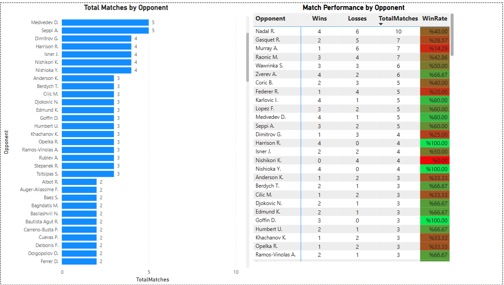
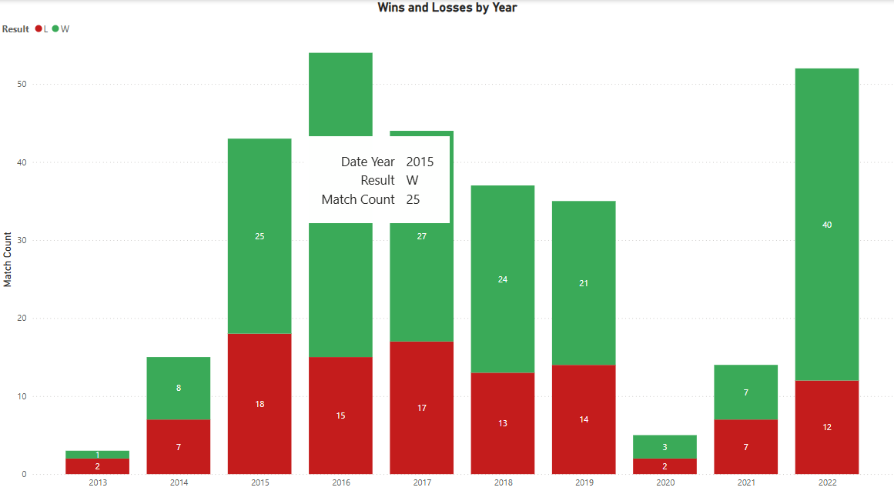

# 🎾 Nick Kyrgios Tennis Performance Dashboard

This Power BI dashboard provides a detailed analysis of **Nick Kyrgios's professional tennis performance** between **2013 and 2022**. The analysis is focused on match results, surface distribution, and opponent-based performance.

---

## 📊 Dashboard Highlights

- **🏟️ Match Distribution by Surface**  
  Pie chart showing how Kyrgios’s matches are distributed across hard, grass, and clay courts.

- **✅ Win Rate per Surface**  
  Column chart visualizing win percentages by surface type.

- **👥 Opponent Analysis**  
  Matrix table and bar chart showing how many times he played against each opponent, with wins, losses, and win rate.

- **📆 Yearly Performance Overview**  
  Stacked bar chart showing win/loss breakdown by year from 2013 to 2022.

- **🎯 Interactive Tooltips & Conditional Formatting**  
  Additional context is displayed through custom tooltips, with color-coded win rates for better visual interpretation.

---
## 📸 Dashboard Preview

### 🎯 Match Distribution by Surface

### 👥 Match Performance by Opponent

### 📆 Wins and Losses by Year

---

## 📄 Downloadable PDF Version

If you don’t have Power BI installed, view the dashboard as PDF:

📥 [Download PDF](./KyrgiosPerformanceDashboard.pdf)

---

## ⚙️ Built With

- [Power BI Desktop](https://powerbi.microsoft.com/)
- DAX for calculated measures
- Data sourced from public tennis datasets:
  - [Tennis Abstract](https://www.tennisabstract.com/)
  - Kaggle datasets

---

## 👨‍💻 Author

**Bora Gençgöz**  
Graduate of Management Information Systems    
📍 GitHub: [@boramir](https://github.com/boramir)

---

## 📌 Notes

This dashboard was created as a personal portfolio project to practice data visualization, storytelling, and analytical thinking using real-world sports data.

⚠️ **Data Note:**  
Some matches are not included in the dataset due to missing or incomplete historical records, especially for lesser-known tournaments or earlier years.  
As a result, total match counts may not reflect Nick Kyrgios's full career history.

*Feedback, stars, and forks are always welcome!*
